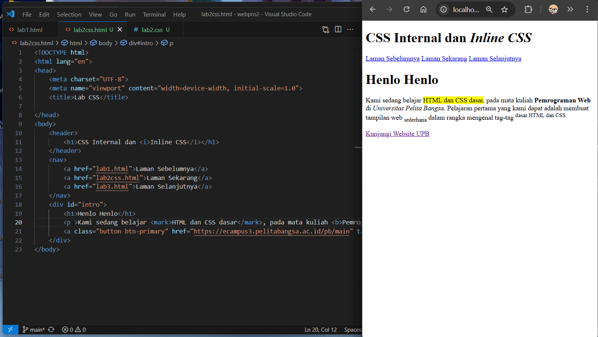
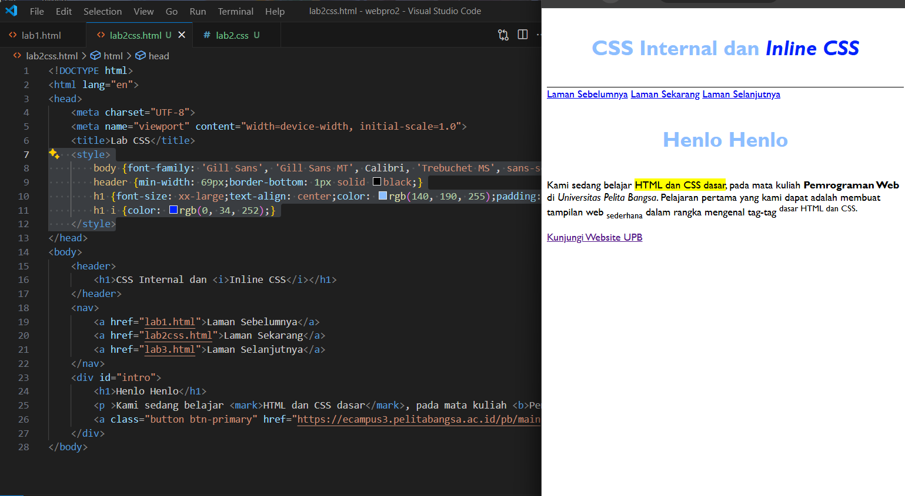
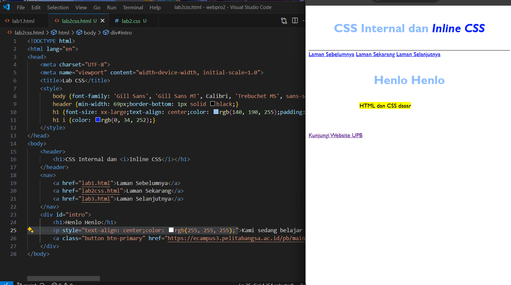
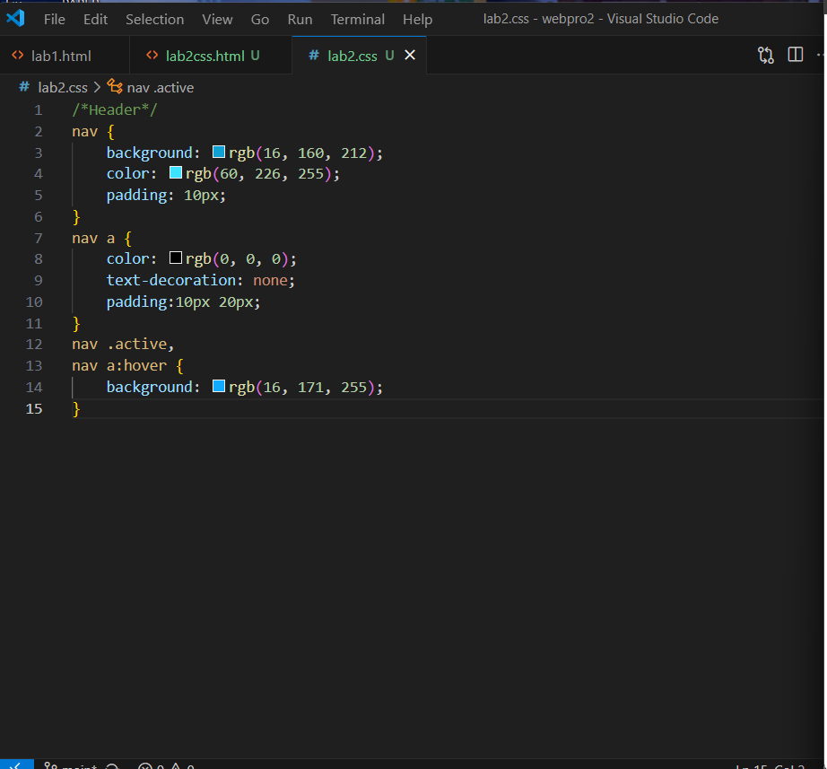
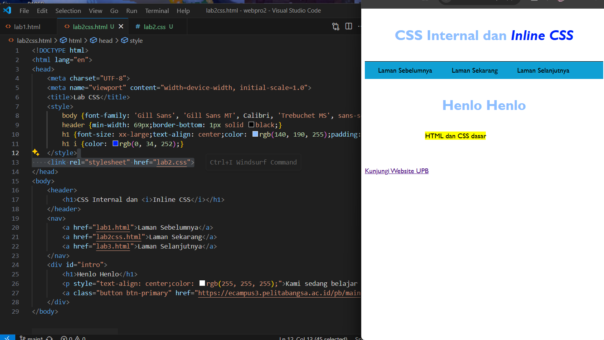
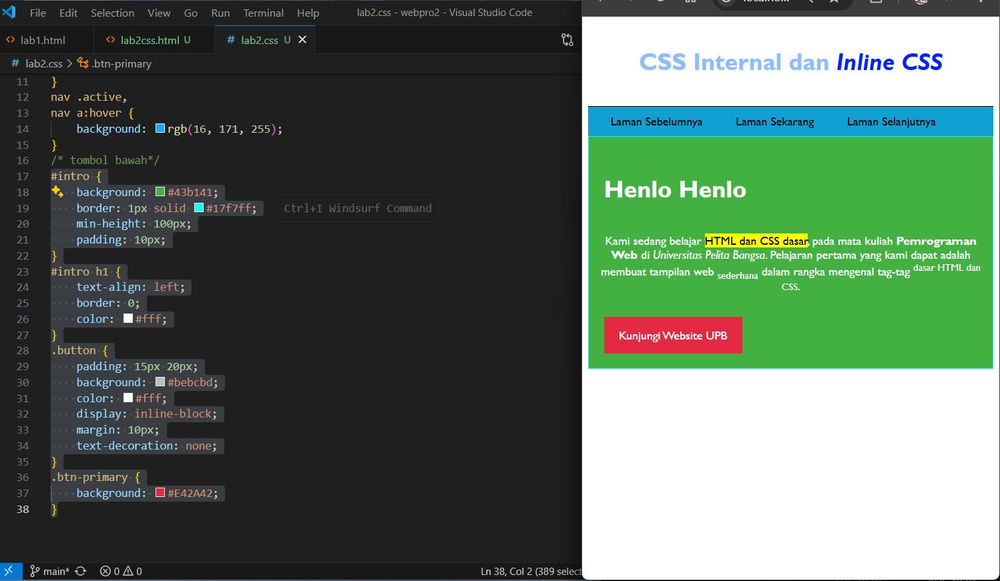

# Latihan CSS dasar

Halo halo, ini adalah lanjutan dari [lab1web html dasar](https://github.com/laLafid/Lab1Web)
Sekarang kita akan mempelajari CSS dasar.

## Langkah-langkah

1. **Siapkan VS Code**
    - Buka dulu aplikasi Visual Studio Code.

2. **Buat file html baru**
    - Buat file baru `lab2css.html` dan masukkan struktur HTML dasar:
    

3. **Mendeklarasikan CSS dengan style**
    - Di bagian `<head>` tambahin `<style>`:
    

4. **Sama aja tapi inline**
    - Di dalam line `<p>` masukin CSS:
    

5. **Buat CSS eksternal**
    - Buat file `lab2.css` masukin:
    
    - Di file html-nya masukin ini:
    

6. **CSS Selector**
    - Tambahin ke dalam file `lab2.css`:
    
    
## Contoh Akhir

'file lab2css.html
```html
<!DOCTYPE html>
<html lang="en">
<head>
    <meta charset="UTF-8">
    <meta name="viewport" content="width=device-width, initial-scale=1.0">
    <title>Lab CSS</title>
    <style>
        body {font-family: 'Gill Sans', 'Gill Sans MT', Calibri, 'Trebuchet MS', sans-serif;} 
        header {min-width: 69px;border-bottom: 1px solid black;}
        h1 {font-size: xx-large;text-align: center;color: rgb(140, 190, 255);padding: 20px 10px;}
        h1 i {color: rgb(0, 34, 252);}
    </style>
    <link rel="stylesheet" href="lab2.css">
</head>
<body> 
    <header>
        <h1>CSS Internal dan <i>Inline CSS</i></h1>
    </header>
    <nav>
        <a href="lab1.html">Laman Sebelumnya</a>
        <a href="lab2css.html">Laman Sekarang</a>
        <a href="lab3.html">Laman Selanjutnya</a>
    </nav>
    <div id="intro">
        <h1>Henlo Henlo</h1>
        <p style="text-align: center;color: rgb(255, 255, 255);">Kami sedang belajar <mark>HTML dan CSS dasar</mark>, pada mata kuliah <b>Pemrograman Web</b> di <i>Universitas Pelita Bangsa</i>. Pelajaran pertama yang kami dapat adalah membuat tampilan web <sub>sederhana</sub> dalam rangka mengenal tag-tag <sup>dasar HTML dan CSS.</sup></p>
        <a class="button btn-primary" href="https://ecampus3.pelitabangsa.ac.id/pb/main" target="_blank">Kunjungi Website UPB</a>
    </div>
</body>
```

'file lab2.css
```css
/*Header*/
nav {
    background: rgb(16, 160, 212);
    color: rgb(60, 226, 255);
    padding: 10px;
}
nav a {
    color: rgb(0, 0, 0);
    text-decoration: none;
    padding:10px 20px;
}
nav .active,
nav a:hover {
    background: rgb(16, 171, 255);
}
/* tombol bawah*/
#intro {
    background: #43b141;
    border: 1px solid #17f7ff;
    min-height: 100px;
    padding: 10px;
}
#intro h1 {
    text-align: left;
    border: 0;
    color: #fff;
}
.button {
    padding: 15px 20px;
    background: #bebcbd;
    color: #fff;
    display: inline-block;
    margin: 10px;
    text-decoration: none;
}
.btn-primary {
    background: #E42A42;
}
```

---
*Selamat mencoba*